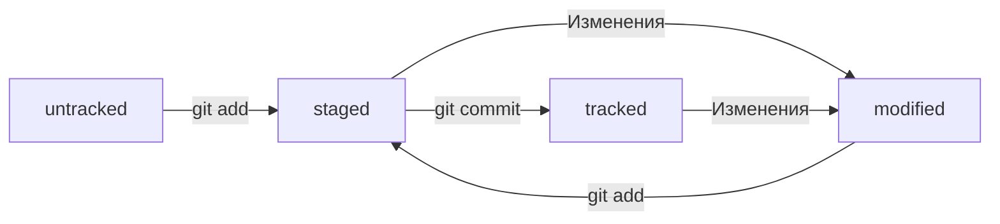

# Шпаргалка по GIT и GITHUB
## Шпаргалка. Командная работа в Git

#### Feature branch workflow
Самый популярный подход к работе с Git в команде — это feature branch workflow. В нём создают ветку для каждой задачи (например, для новой функциональности или исправления бага), а когда всё готово, вливают новую ветку в main.
Важные этапы этого процесса — пул-реквест и ревью изменений. Пул-реквест — это интерфейс, в котором можно обсудить изменения. Ревью — просмотр изменений другими участниками и один из способов проверить качество таких изменений.
Если вы уже участник проекта (или collaborator в терминах GitHub), можно клонировать репозиторий напрямую. А если нет, нужно предварительно сделать «форк». Также для участников доступна кнопка Merge после ревью, а для неучастников — нет.
#### Конфликты слияния
Когда один и тот же файл меняется в нескольких ветках, при их слиянии может произойти конфликт. Пугаться конфликтов не нужно, это нормальная часть работы с системами контроля версий. IDE, вроде VSCode или Intellij IDEA, помогут «склеить» файл из двух конфликтующих версий.
#### Алгоритм-шпаргалка для создания PR
1. Склонировать репозиторий. 
1.1 Если вы не участник проекта, предварительно сделать «форк» исходного репозитория. 
1.2 На странице репозитория или «форка» нажать кнопки: Code → SSH → скопировать ссылку. 
1.3 Выполнить команду git clone <ссылка на репозиторий>. 
2. Создать ветку для вашей задачи: git checkout -b my-task-branch-name.
3. Добавить и «закоммитить» изменения, которые вы хотите внести в проект.
4. «Запушить» ветку: git push --set-upstream origin HEAD или git push -u origin my-task-branch-name. 
4.1 GitHub (с помощью Git) выведет ссылку на создание PR. По ней нужно перейти. 
4.2 PR можно также создать через интерфейс GitHub. 
5. Сообщить о пул-реквесте ревьюеру. 
5.1 Иногда ревьюеры назначаются автоматически, тогда сообщать не нужно. 
6. Обсуждать с ревьюером предлагаемые изменения и вносить правки, пока эти изменения не будут одобрены (пока не будет получен «апрув»). 
6.1. Если кто-то добавил конфликтующие изменения в main, пока ваш PR был на ревью, нужно разрешить конфликт:   
* Обновить main: git checkout main && git pull.
* Влить main в свою ветку: git checkout my-task-branch-name && git merge main.
* Разрешить конфликты слияния с помощью IDE или вручную.
* Создать коммит слияния: git commit --no-edit или git commit -m 'merge main'.
* Сделать git push своей ветки.
7. Нажать кнопку Merge или подождать, пока её нажмёт кто-то ещё.
8. Ещё раз обновить main, чтобы «подтянуть» ваши изменения в основную ветку локального репозитория: git checkout main && git pull.
9. Вы великолепны! Можете начинать снова со второго пункта.
#### Алгоритм-шпаргалка для разрешения конфликтов слияния
1. Открыть проект в IDE (VS Code, IDEA или другие).
2. Открыть файл, в котором есть конфликт.
3. Выбрать, какие части файла нужно взять из одной ветки, а какие — из другой.
4. Когда конфликты разрешены, сделать коммит: git commit --no-edit или git commit -m 'merge branch <название ветки>'.

## Шпаргалка. Работа с ветками
#### Клонирование чужого репозитория
git clone git@github.com:YandexPraktikum/first-project.git (от англ. clone, «клон», «копия») — склонируй репозиторий с URL first-project.git из аккаунта YandexPraktikum на мой локальный компьютер. 
#### Создание веток
git branch feature/the-finest-branch (от англ. branch, «ветка») — создай ветку от текущей с названием feature/the-finest-branch; 
git checkout -b feature/the-finest-branch — создай ветку feature/the-finest-branch и сразу переключись на неё. 
#### Навигация по веткам
git branch (от англ. branch, «ветка») — покажи, какие есть ветки в репозитории и в какой из них я нахожусь (текущая ветка будет отмечена символом *); 
git branch -a — покажи все известные ветки, как локальные (в локальном репозитории), так и удалённые (в origin, или на GitHub). 
git checkout feature/br — переключись на ветку feature/br. 
#### Сравнение веток
git diff main HEAD (от англ. difference, «отличие», «разница») — покажи разницу между веткой main и указателем на HEAD; 
git diff HEAD~2 HEAD — покажи разницу между тем коммитом, который был два коммита назад, и текущим. 
#### Удаление веток
git branch -d br-name — удали ветку br-name, но только если она является частью main; 
git branch -D br-name — удали ветку br-name, даже если она не объединена с main. 
#### Слияние веток
git merge main (от англ. merge, «сливать», «поглощать») — объедини ветку main с текущей активной веткой. 
#### Работа с удалённым репозиторием
git push -u origin my-branch (от англ. push, «толкнуть», «протолкнуть») — отправь новую ветку my-branch в удалённый репозиторий и свяжи локальную ветку с удалённой, чтобы при дополнительных коммитах можно было писать просто git push без -u; 
git push my-branch — отправь дополнительные изменения в ветку my-branch, которая уже существует в удалённом репозитории; 
git pull (от англ. pull, «вытянуть») — подтяни изменения текущей ветки из удалённого репозитория. 

#### Инициализация репозитория
git init (от англ. initialize, «инициализировать») — инициализируй репозиторий. 
#### Синхронизация локального и удалённого репозиториев
git remote add origin https://github.com/YandexPracticum/first-project.git (от англ. remote, «удалённый» + add, «добавить») — привяжи локальный репозиторий к удалённому с URL https://github.com/YandexPracticum/first-project.git; 
git remote -v (от англ. verbose, «подробный») — проверь, что репозитории действительно связались; 
git push -u origin main (от англ. push, «толкать») — в первый раз загрузи все коммиты из локального репозитория в удалённый с названием origin. 
#### Ваша ветка может называться master, а не main. Подправьте команду, если это необходимо. 
git push (от англ. push, «толкать») — загрузи коммиты в удалённый репозиторий после того, как он был привязан с помощью флага -u. 
#### Подготовка файла к коммиту
git add todo.txt (от англ. add, «добавить») — подготовь файл todo.txt к коммиту; 
git add --all (от англ. add, «добавить» + all, «всё») — подготовь к коммиту сразу все файлы, в которых были изменения, и все новые файлы; 
git add . — подготовь к коммиту текущую папку и все файлы в ней. 
#### Создание и публикация коммита
git commit -m "Комментарий к коммиту." (от англ. commit, «совершать», фиксировать» + message, «сообщение») — сделай коммит и оставь комментарий, чтобы было проще понять, какие изменения сделаны; 
git push (от англ. push, «толкать») — добавь изменения в удалённый репозиторий. 
#### Просмотр информации о коммитах
git log (от англ. log, «журнал [записей]») — выведи подробную историю коммитов; 
git log --oneline (от англ. log, «журнал [записей]» + oneline, «одной строкой») — покажи краткую информацию о коммитах: сокращённый хеш и сообщение. 
#### Просмотр состояния файлов
git status (от англ. status, «статус», «состояние») — покажи текущее состояние репозитория. 
#### Добавление изменений в последний коммит
git commit --amend --no-edit (от англ. amend, «исправить») — добавь изменения к последнему коммиту и оставь сообщение прежним; 
git commit --amend -m "Новое сообщение" — измени сообщение к последнему коммиту на Новое сообщение. 
#### Выйти из редактора Vim: нажать Esc, ввести :qa!, нажать Enter.
#### «Откат» файлов и коммитов
git restore --staged hello.txt (от англ. restore, «восстановить») — переведи файл hello.txt из состояния staged обратно в untracked или modified; 
git restore hello.txt — верни файл hello.txt к последней версии, которая была сохранена через git commit или git add; 
git reset --hard b576d89 (от англ. reset, «сброс», «обнуление» + hard, «суровый») — удали все незакоммиченные изменения из staging и «рабочей зоны» вплоть до указанного коммита. 
#### Просмотр изменений
git diff (от англ. difference, «отличие», «разница») — покажи изменения в «рабочей зоне», то есть в modified-файлах; 
git diff a9928ab 11bada1 — выведи разницу между двумя коммитами; 
git diff --staged — покажи изменения, которые добавлены в staged-файлах. 

## Из чего состоит коммит
#### HEAD 
Один из служебных файлов папки .git. Он указывает на коммит, который сделан последним (то есть на самый новый).
#### COMMIT 

Состоит:
<ol>
	<li>1-ая строка из цифр и латинских букв после слова commit — это хеш коммита;</li>
	<li>Author — имя автора и его электронная почта;</li>
	<li>Date — дата и время создания коммита;</li>
	<li>в конце находится сообщение коммита.</li>
</ol>

#### HASH - идентификатор коммита 
Хеш - это короткая (4040 символов в случае SHA-1) строка, которая состоит из цифр 0 - 9 и латинских букв A - F (неважно, заглавных или строчных). 
Хеширование (от англ. hash, «рубить», «крошить», «мешанина») - это способ преобразовать набор данных и получить их «отпечаток» (англ. fingerprint). 
Git хеширует (преобразует) информацию о коммите с помощью алгоритма SHA-1 (от англ. Secure Hash Algorithm - «безопасный алгоритм хеширования») и получает для каждого коммита свой уникальный хеш - результат хеширования. 
Информация о коммите - это набор данных: когда был сделан коммит, содержимое файлов в репозитории на момент коммита и ссылка на предыдущий, или родительский (англ. parent), коммит. 
Git хранит таблицу соответствий *хеш → информация о коммите*.
## Статусы файлов 

| Статус   | Определение |
| -------- | ------- |
| untracked | англ. «неотслеживаемый» |
| staged | англ. «подготовленный» |
| tracked | англ. «отслеживаемый» |
| modified | англ. «изменённый» |

## Шпаргалка по GIT
| Команда   | Определение |
| -------- | ------- |
| git init | от англ. initialize — «инициализировать» папку |
| rm -rf .git | «разгитить» папку |
| git status | проверить состояние репозитория |
| git add | подготовить файл к сохранению |
| git add --all | подготовить все файлы к сохранению |
| git commit -m | выполнить коммит |
| git log | просмотреть историю коммитов |
| git log | получить сокращённый лог |
| git version | посмотреть версию |
| git config --global | работа с файлом настройки .gitconfig |
| git config --list  | вывести содержимое файла конфигурации Git |
| git config --global | работа с файлом настройки .gitconfig |

## Шпаргалка. Базовые команды в консоли

pwd (от англ. print working directory, «показать рабочую папку») — покажи, в какой я папке; 
ls (от англ. list directory contents, «отобразить содержимое директории») — покажи файлы и папки в текущей папке; 
ls -a — покажи также скрытые файлы и папки, названия которых начинаются с символа .; 
cd first-project (от англ. change directory, «сменить директорию») — перейди в папку first-project; 
cd first-project/html — перейди в папку html, которая находится в папке first-project; 
cd .. — перейди на уровень выше, в родительскую папку; 
cd ~ — перейди в домашнюю директорию (/Users/Username); 
cd / — перейди в корневую директорию. 

### Работа с файлами и папками 

#### Создание 
touch index.html (англ. touch, «коснуться») — создай файл index.html в текущей папке; 
touch index.html style.css script.js — если нужно создать сразу несколько файлов, можно напечатать их имена в одну строку через пробел; 
mkdir second-project (от англ. make directory, «создать директорию») — создай папку с именем second-project в текущей папке. 

#### Копирование и перемещение 
cp file.txt ~/my-dir (от англ. copy, «копировать») — скопируй файл в другое место; 
mv file.txt ~/my-dir (от англ. move, «переместить») — перемести файл или папку в другое место. 

#### Чтение 
cat file.txt (от англ. concatenate and print, «объединить и распечатать») — распечатай содержимое текстового файла file.txt. 

#### Удаление 
rm about.html (от англ. remove, «удалить») — удали файл about.html; 
rmdir images (от англ. remove directory, «удалить директорию») — удали папку images; 
rm -r second-project (от англ. remove, «удалить» + recursive, «рекурсивный») — удали папку second-project и всё, что она содержит. 
#### Полезные возможности 
Команды необязательно печатать и выполнять по очереди. Можно указать их списком — разделить двумя амперсандами (&&). 
У консоли есть собственная память — буфер с несколькими последними командами. По ним можно перемещаться с помощью клавиш со стрелками вверх (↑) и вниз (↓). 
Чтобы не вводить название файла или папки полностью, можно набрать первые символы имени и дважды нажать Tab. Если файл или папка есть в текущей директории, командная строка допишет путь сама. 
Например, вы находитесь в папке dev. Начните вводить cd first и дважды нажмите Tab. Если папка first-project есть внутри dev, командная строка автоматически подставит её имя. Останется только нажать Enter. 
